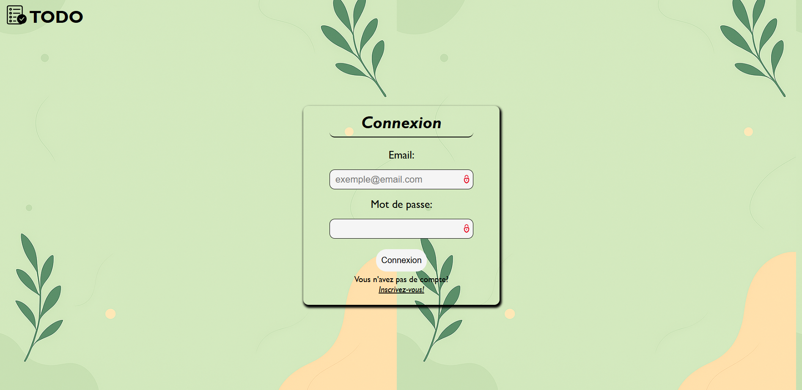
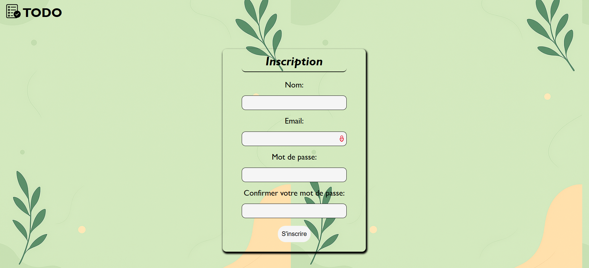
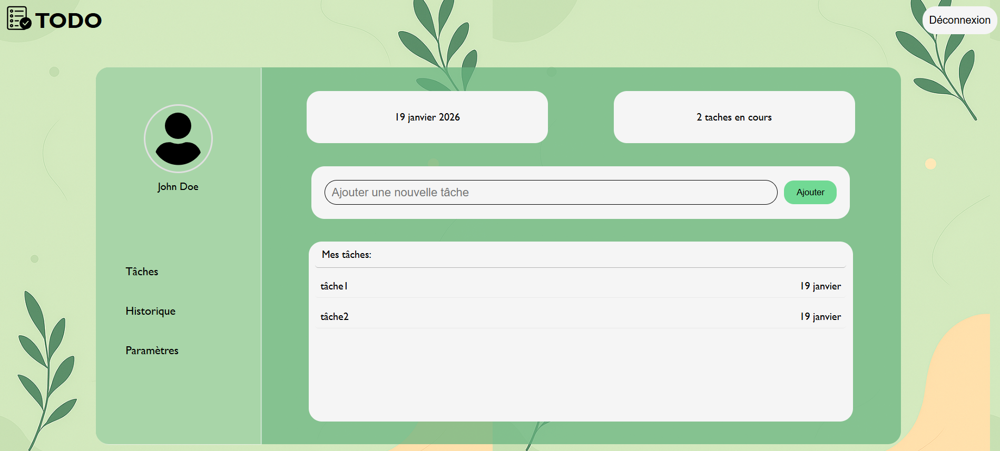

## Clone the repository
git clone https://github.com/TiavinaRak/todo-list.git
cd todo-list

## Create a virtual environment
python -m venv venv
source venv/bin/activate   # On Linux/Mac
venv\Scripts\activate      # On Windows

## Install depnedencies
pip install -r requirements.txt

## Run the application
flask run
then open http://127.0.0.1:5000 in your favorite browser

## Sample of the project
# Connection/inscription 

# Home

## Future improvements
